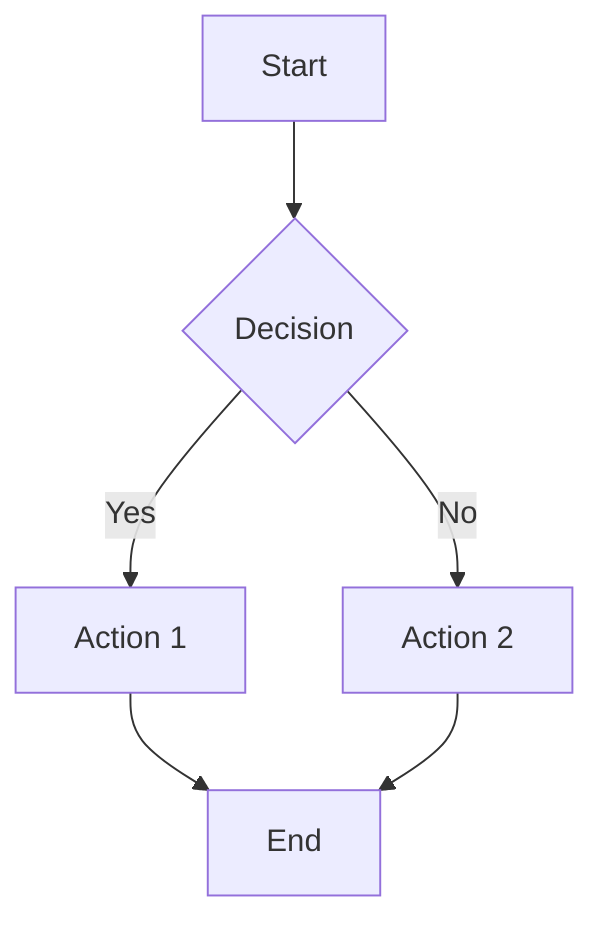
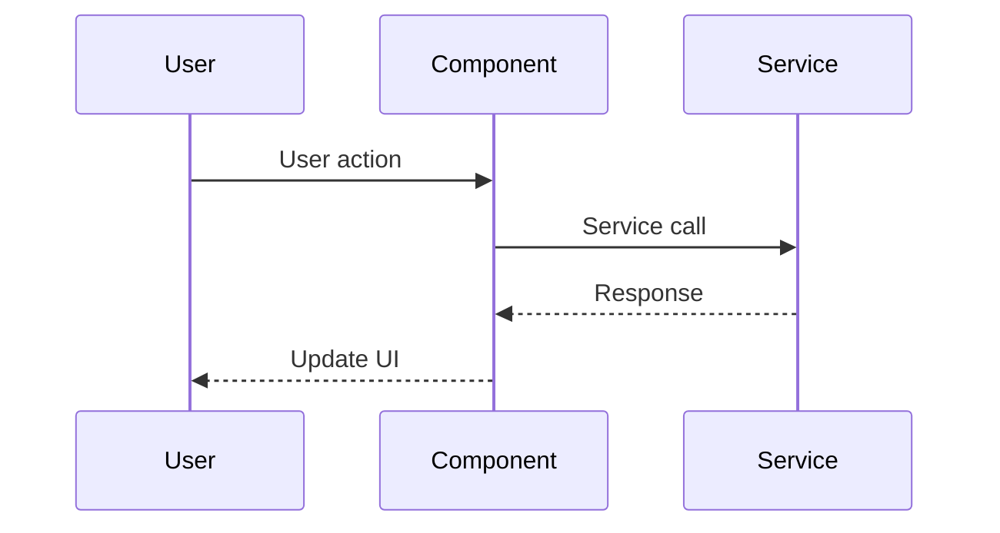
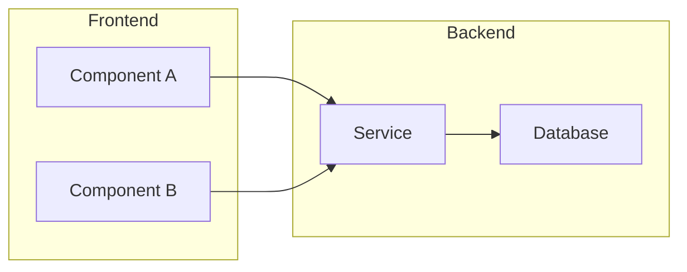
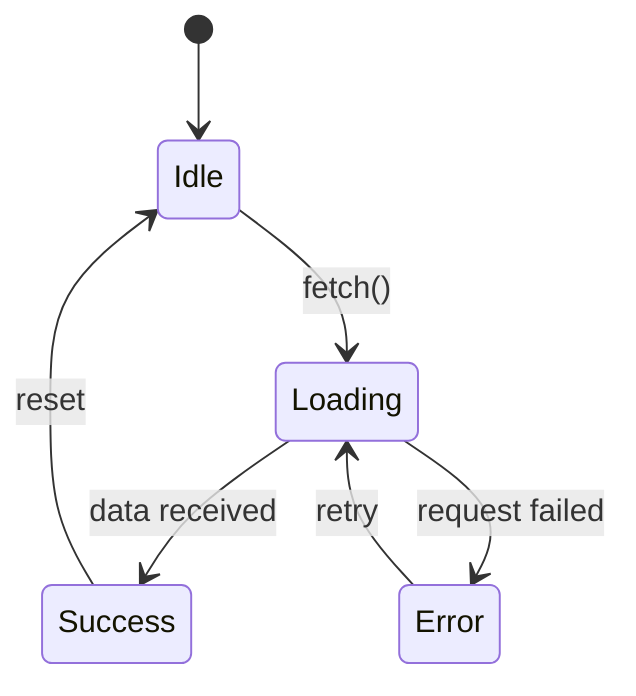

## User Input

```text
$ARGUMENTS
```

You **MUST** consider the user input before proceeding (if not empty).

## Overview

The Technical Specialist creates and maintains technical documentation:
- Architecture diagrams (Mermaid syntax)
- Component/feature specifications
- README documentation
- API documentation
- Technical decision records

## Documentation Types

### Architecture Diagrams

Use Mermaid syntax for GitHub-native rendering.

**Principles**:
- One concept per diagram (don't overcrowd)
- Use consistent naming conventions
- Include legend when using custom styling
- Keep text concise in nodes

**Common Diagram Types**:

#### Flowcharts


#### Sequence Diagrams


#### Component Diagrams


#### State Diagrams


### Feature Specifications

Follow SpecKit format (see existing `specs/` directory):

```markdown
# Feature: [Name]

## Goal
[1-2 sentences on what this achieves]

## Context
[Background and why this is needed]

## Deliverables
- [ ] Deliverable 1
- [ ] Deliverable 2

## Approach
[High-level implementation strategy]

## Open Questions
- [ ] Question 1
- [ ] Question 2

## Exit Criteria
- [ ] Criterion 1
- [ ] Criterion 2
```

### Component READMEs

Structure for component documentation:

```markdown
# Component Name

Brief description of what this component does.

## Installation

\`\`\`bash
npm install component-name
\`\`\`

## Usage

\`\`\`typescript
import { Component } from 'component-name';

// Basic usage example
const instance = new Component();
\`\`\`

## API

### `methodName(param: Type): ReturnType`

Description of what the method does.

**Parameters**:
- `param` - Description of parameter

**Returns**: Description of return value

**Example**:
\`\`\`typescript
component.methodName('value');
\`\`\`

## Configuration

| Option | Type | Default | Description |
|--------|------|---------|-------------|
| `option1` | `string` | `'default'` | What it does |
| `option2` | `boolean` | `false` | What it does |

## Development

\`\`\`bash
# Run tests
npm test

# Build
npm run build
\`\`\`

## Contributing

[Link to contribution guidelines]
```

### API Documentation

For REST APIs:

```markdown
# API Reference

## Base URL

\`https://api.example.com/v1\`

## Authentication

All requests require Bearer token in Authorization header.

## Endpoints

### GET /resource

Retrieves a list of resources.

**Query Parameters**:
| Parameter | Type | Required | Description |
|-----------|------|----------|-------------|
| `limit` | integer | No | Max items (default: 20) |
| `offset` | integer | No | Pagination offset |

**Response**:
\`\`\`json
{
  "data": [...],
  "meta": {
    "total": 100,
    "limit": 20,
    "offset": 0
  }
}
\`\`\`

**Status Codes**:
- `200` - Success
- `401` - Unauthorized
- `500` - Server error
```

### Technical Decision Records (TDRs)

```markdown
# TDR-001: [Decision Title]

**Status**: Proposed | Accepted | Deprecated | Superseded
**Date**: YYYY-MM-DD
**Deciders**: [Names]

## Context

[What is the issue or situation that requires a decision?]

## Decision

[What is the change that we're proposing and/or doing?]

## Consequences

### Positive
- [Benefit 1]
- [Benefit 2]

### Negative
- [Drawback 1]
- [Drawback 2]

### Neutral
- [Side effect 1]

## Alternatives Considered

### Option A: [Name]
[Description and why not chosen]

### Option B: [Name]
[Description and why not chosen]
```

## Generation Workflow

### Step 1: Understand Context

1. **Identify scope**: What needs documentation
2. **Find existing docs**: Check `docs/`, `specs/`, README files
3. **Gather technical details**: Code structure, APIs, data flow

### Step 2: Choose Format

| Content Need | Recommended Format |
|--------------|-------------------|
| System overview | Architecture diagram |
| Data flow | Sequence diagram |
| Component states | State diagram |
| New feature | Feature spec |
| Library/package | Component README |
| HTTP endpoints | API documentation |
| Major decision | TDR |

### Step 3: Draft Documentation

1. Start with outline/structure
2. Fill in details systematically
3. Add diagrams where they clarify
4. Include examples for APIs/code

### Step 4: Review Checklist

- [ ] Accurate and up-to-date
- [ ] Consistent terminology with codebase
- [ ] Diagrams render correctly (test Mermaid)
- [ ] Code examples are tested/valid
- [ ] Links are functional
- [ ] Follows existing documentation patterns

## Output Format

```markdown
## Technical Documentation Generated

### Document Type
[Diagram | Spec | README | API Doc | TDR]

### Location
`path/to/document.md`

### Preview

---

[Full document content here]

---

### Related Files
- [List any related documents that may need updates]

### Diagrams Included
- [List any Mermaid diagrams with brief description]
```

## Quick Reference

| Task | Template | Location |
|------|----------|----------|
| New architecture diagram | Mermaid flowchart/sequence | `docs/architecture/` |
| Feature spec | SpecKit format | `specs/NNN-feature/` |
| Component docs | README template | Component directory |
| API reference | OpenAPI/Markdown | `docs/api/` |
| Decision record | TDR template | `docs/decisions/` |
