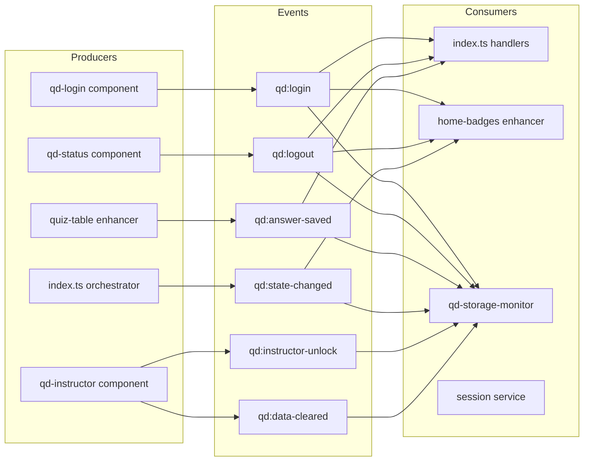
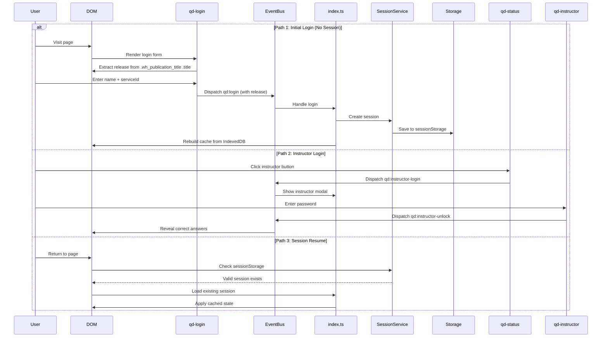
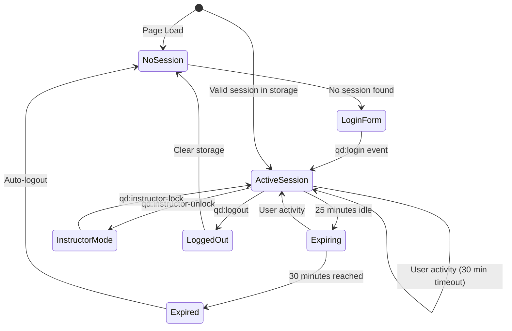
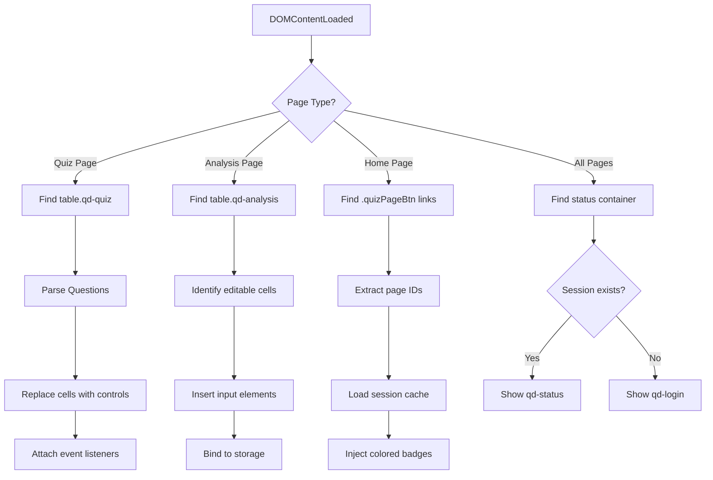
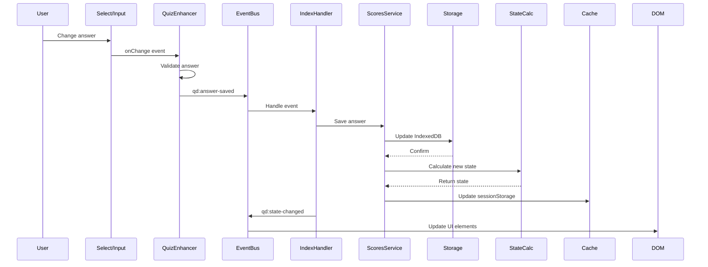
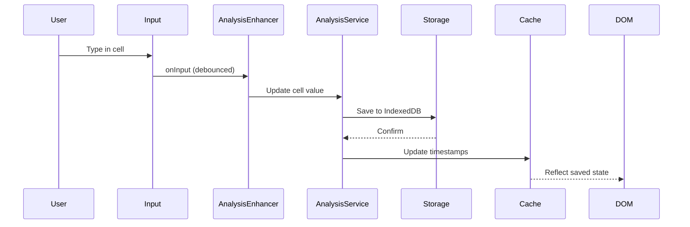
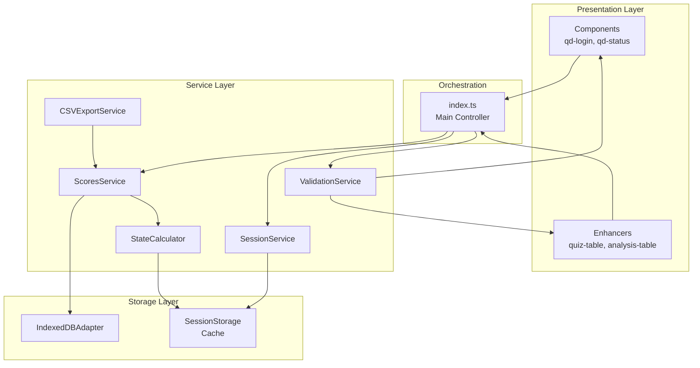

# Architecture Flows and Patterns

This document captures the deep architectural patterns, event flows, and DOM manipulation strategies used in the Sonar Quiz System.

## Table of Contents
1. [Event System Architecture](#event-system-architecture)
2. [Login Process Flows](#login-process-flows)
3. [DOM Class Identification Strategy](#dom-class-identification-strategy)
4. [Data Flow Sequences](#data-flow-sequences)
5. [Service Layer Interactions](#service-layer-interactions)

---

## 1. Event System Architecture

### Event Namespace
All custom events use the `qd:` namespace for isolation and clarity.

### Event Producers and Consumers



### Event Details

| Event | Producer | Consumers | Payload | Purpose |
|-------|----------|-----------|---------|---------|
| `qd:login` | qd-login | index.ts, home-badges, storage-monitor | SessionData | User authentication |
| `qd:logout` | qd-status | index.ts, home-badges, storage-monitor | {serviceId} | Session termination |
| `qd:answer-saved` | quiz-table enhancer | index.ts, storage-monitor | {pageId, answer} | Quiz progress |
| `qd:state-changed` | index.ts | home-badges, storage-monitor | {pageId, state} | Page completion state |
| `qd:instructor-unlock` | qd-instructor | storage-monitor, quiz tables | {timestamp} | Reveal answers |
| `qd:instructor-login` | qd-login, qd-status | index.ts | {password} | Instructor auth |
| `qd:data-cleared` | qd-instructor | storage-monitor | {timestamp} | Data erasure |

---

## 2. Login Process Flows

### Release ID Extraction
**CRITICAL**: Before any login can succeed, the system must extract the Release ID from the DOM structure created by DITA publishing.

```typescript
// Release ID is ALWAYS extracted from DOM, NEVER from user input
const titleElement = document.querySelector('.wh_publication_title .title');
const release = titleElement?.textContent?.trim() || '';

// Required HTML structure (added by DITA):
// <div class="wh_publication_title">
//   <span class="title">TRV Connectors Autumn 2025</span>
// </div>
```

**Common Mistake**: Attempting to read `release` from a form input field. This field does NOT exist - release comes from the publication title element only.

### Three Login Paths



### Session Lifecycle



---

## 3. DOM Class Identification Strategy

### CSS Class Hierarchy

```
Document Root
├── Publication Title (.wh_publication_title)
│   └── Title Text (.title) [RELEASE ID SOURCE]
│
├── Navigation (.wh_top_menu_and_indexterms_link)
│   └── Status Panel (#qd-status) [INJECTED]
│
├── Content Area
│   ├── Quiz Tables (table.qd-quiz)
│   │   ├── Question Rows
│   │   └── Answer Controls [ENHANCED]
│   │
│   └── Analysis Tables (table.qd-analysis)
│       ├── Static Cells (with background-color)
│       └── Editable Cells [ENHANCED]
│
└── Home Page
    └── Navigation Links (.quizPageBtn)
        └── Status Badges (.qd-badge) [INJECTED]
```

### Class Detection and Enhancement

| CSS Class | Purpose | Detection Method | Enhancement |
|-----------|---------|------------------|-------------|
| `.qd-quiz` | Quiz table marker | `querySelectorAll('table.qd-quiz')` | Convert to interactive quiz |
| `.qd-analysis` | Analysis table marker | `querySelectorAll('table.qd-analysis')` | Add editable inputs |
| `.quizPageBtn` | Navigation links | `querySelectorAll('.quizPageBtn')` | Inject R/A/G badges |
| `.wh_top_menu_and_indexterms_link` | Status panel container | `querySelector(config.statusPanelContainer)` | Append qd-status |
| `#qd-status` | Status panel anchor | `getElementById('qd-status')` | Replace with component |

### DOM Enhancement Flow



---

## 4. Data Flow Sequences

### Quiz Answer Save Flow



### Analysis Cell Edit Flow



---

## 5. Service Layer Interactions

### Service Dependencies



### Service Responsibilities

| Service | Purpose | Dependencies | Events |
|---------|---------|--------------|--------|
| SessionService | Manage user sessions | SessionStorage | qd:login, qd:logout |
| ScoresService | Save/load quiz answers | IndexedDBAdapter, StateCalculator | qd:answer-saved |
| ValidationService | Validate author content | None | Error banners |
| StateCalculator | Compute R/A/G states | None | qd:state-changed |
| CSVExportService | Export quiz results | ScoresService | Download trigger |
| IndexedDBAdapter | Persistent storage | None | Storage events |

### Critical Service Interactions

1. **Session Creation**:
   ```
   qd-login → SessionService.create() → sessionStorage → Rebuild cache from IndexedDB
   ```

2. **Answer Save**:
   ```
   Quiz input → ScoresService.saveAnswer() → IndexedDB → StateCalculator → Cache update → Event dispatch
   ```

3. **Instructor Unlock**:
   ```
   Password verify → Session.instructorUnlocked = true → Broadcast to all tables → Reveal overlays
   ```

4. **Cache Rebuild**:
   ```
   Login/Logout → Clear cache → Iterate IndexedDB records → Calculate states → Write to sessionStorage
   ```

---

## Architectural Decisions

### Why Custom Events?
- **Decoupling**: Components don't need direct references
- **Debugging**: All events visible in DevTools
- **Extensibility**: New consumers can listen without modifying producers
- **Cross-frame**: Events can bubble through Shadow DOM boundaries

### Why SessionStorage for Cache?
- **Performance**: Faster than IndexedDB for frequent reads
- **Automatic cleanup**: Clears on tab close
- **Synchronous API**: No async overhead for UI updates
- **Session-scoped**: Natural session boundary

### Why CSS Classes for Detection?
- **Author-friendly**: Content creators understand CSS
- **Stable contracts**: Classes unlikely to change
- **Progressive enhancement**: Works without JavaScript
- **Tooling support**: Oxygen editor shows classes

### Why Shadow DOM for Components?
- **Style isolation**: No CSS leakage
- **Encapsulation**: Protected internal state
- **Standard API**: Native browser feature
- **Event bubbling**: Still participates in document events