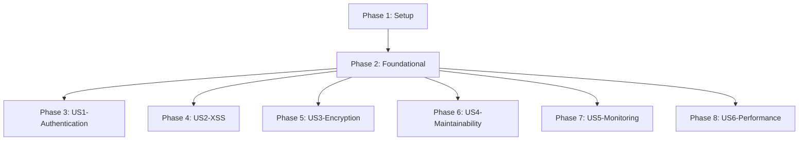

# Tasks: Security Remediation and Code Quality Improvements

**Feature Branch**: `001-security-refactor`
**Created**: 2025-11-15
**Total Tasks**: 72
**Estimated Duration**: 1-2 weeks

## Overview

Task breakdown for security remediation organized by user story priority. Each story can be implemented and tested independently, following TDD principles as mandated by the constitution.

## Phase Structure

- **Phase 1**: Setup & Environment Configuration (5 tasks)
- **Phase 2**: Foundational Security Utilities (12 tasks)
- **Phase 3**: User Story 1 - Secure Instructor Authentication [P1] (11 tasks)
- **Phase 4**: User Story 2 - XSS Attack Protection [P1] (11 tasks)
- **Phase 5**: User Story 3 - Secure Session Storage [P1] (11 tasks)
- **Phase 6**: User Story 4 - Code Maintainability [P2] (10 tasks)
- **Phase 7**: User Story 5 - Security Monitoring [P2] (8 tasks)
- **Phase 8**: User Story 6 - Performance Optimization [P3] (4 tasks)

---

## Phase 1: Setup & Environment Configuration

**Goal**: Configure build environment for security features
**Duration**: 30 minutes

### Tasks

- [X] T001 Create .env file with VITE_INSTRUCTOR_PASSWORD_HASH variable in project root
- [X] T002 Update .gitignore to exclude .env files
- [X] T003 [P] Configure vite.config.ts to inject environment variables at build time
- [X] T004 [P] Create src/utils/ directory structure for new utilities
- [X] T005 [P] Create tests/security/ directory for security test suites

---

## Phase 2: Foundational Security Utilities

**Goal**: Create core security utilities needed by multiple user stories
**Duration**: 2-3 hours
**Note**: These utilities are prerequisites for P1 stories

### Tasks

- [X] T006 Write failing test for constant-time comparison in tests/security/timing-safe.test.ts
- [X] T007 Implement constantTimeCompare function in src/utils/security.ts
- [X] T008 [P] Write failing test for Web Crypto key derivation in tests/security/crypto.test.ts
- [X] T009 Implement deriveKey function in src/utils/crypto.ts
- [X] T010 [P] Write failing test for AES-GCM encryption in tests/security/crypto.test.ts
- [X] T011 Implement encrypt/decrypt functions in src/utils/crypto.ts
- [X] T012 [P] Write failing test for DOM sanitization in tests/security/sanitizer.test.ts
- [X] T013 Implement sanitizeInput function in src/utils/dom-sanitizer.ts
- [X] T014 [P] Write failing test for secure storage helpers in tests/unit/utils/storage.test.ts
- [X] T015 Implement getJSON/setJSON functions in src/utils/storage-helpers.ts
- [X] T016 [P] Create security logger interface in src/utils/logger.ts
- [X] T017 Verify all foundational utility tests pass

---

## Phase 3: User Story 1 - Secure Instructor Authentication [P1]

**Goal**: Remove hardcoded password and implement secure authentication with rate limiting
**Duration**: 2-3 hours
**Independent Test**: Instructor mode only accessible with configured password, rate limiting prevents brute force

### Tasks

- [ ] T018 [US1] Write E2E test for environment variable password configuration in tests/e2e/security/authentication.spec.ts
- [X] T019 [US1] Write unit test for password validation without hardcoded default in tests/security/authentication.test.ts
- [X] T020 [US1] Remove hardcoded 'instructor' password from src/components/qd-instructor.ts:854-857
- [X] T021 [US1] Update password validation to use import.meta.env.VITE_INSTRUCTOR_PASSWORD_HASH in src/components/qd-instructor.ts
- [X] T022 [US1] Replace string comparison with constantTimeCompare in src/components/qd-instructor.ts:867
- [X] T023 [P] [US1] Write failing test for rate limiting in tests/security/rate-limiter.test.ts
- [X] T024 [US1] Implement RateLimiter class with exponential backoff in src/utils/rate-limiter.ts
- [X] T025 [US1] Integrate RateLimiter with instructor unlock in src/components/qd-instructor.ts
- [X] T026 [US1] Add lockout UI feedback in src/components/qd-instructor.ts template
- [ ] T027 [US1] Write E2E test for rate limiting behavior in tests/e2e/security/rate-limiting.spec.ts
- [X] T028 [US1] Verify all US1 authentication tests pass

---

## Phase 4: User Story 2 - Protection from XSS Attacks [P1]

**Goal**: Eliminate XSS vulnerabilities by replacing innerHTML with safe alternatives
**Duration**: 2-3 hours
**Independent Test**: Script tags and HTML in content are escaped and never executed

### Tasks

- [X] T029 [US2] Write test for XSS prevention in quiz content in tests/security/xss.test.ts
- [X] T030 [US2] Write test for XSS prevention in validation errors in tests/security/xss.test.ts
- [X] T031 [US2] Replace innerHTML with textContent for correct answer reveal in src/enhancers/quiz-table.ts:544
- [X] T032 [US2] Replace innerHTML with createElement for answer options in src/enhancers/quiz-table.ts:553
- [X] T033 [US2] Replace innerHTML with createElement for answer detail in src/enhancers/quiz-table.ts:556
- [X] T034 [US2] Replace innerHTML with createElement for validation banner in src/index.ts:260
- [X] T035 [P] [US2] Create safe banner creation utility in src/utils/dom-helpers.ts
- [X] T036 [US2] Update all error message displays to use sanitizeInput in src/enhancers/quiz-table.ts
- [X] T037 [US2] Update all user content displays to use sanitizeInput in src/enhancers/analysis-table.ts
- [ ] T038 [US2] Write E2E test for XSS prevention in tests/e2e/security/xss-prevention.spec.ts
- [X] T039 [US2] Verify all US2 XSS prevention tests pass

---

## Phase 5: User Story 3 - Secure Session Data Storage [P1]

**Goal**: Encrypt sensitive session data in browser storage
**Duration**: 3-4 hours
**Independent Test**: SessionStorage contains only encrypted data, no plaintext PII visible

### Tasks

- [ ] T040 [US3] Write test for session encryption in tests/security/encryption.test.ts
- [ ] T041 [US3] Write test for encrypted storage helpers in tests/unit/utils/encrypted-storage.test.ts
- [ ] T042 [US3] Implement getEncryptedJSON/setEncryptedJSON in src/utils/storage-helpers.ts
- [ ] T043 [US3] Update SessionService.saveSession to encrypt data in src/services/session.ts:201
- [ ] T044 [US3] Update SessionService.getSession to decrypt data in src/services/session.ts:47-65
- [ ] T045 [US3] Update session creation to use encryption in src/index.ts:547
- [ ] T046 [US3] Add session migration for existing plaintext data in src/services/session.ts
- [ ] T047 [US3] Implement auto-clear on session timeout in src/services/session.ts:89-99
- [ ] T048 [US3] Add beforeunload handler to clear session in src/index.ts
- [ ] T049 [US3] Write E2E test for encrypted storage in tests/e2e/security/encrypted-storage.spec.ts
- [ ] T050 [US3] Verify all US3 encryption tests pass

---

## Phase 6: User Story 4 - Improved Code Maintainability [P2]

**Goal**: Extract duplicated code into reusable utilities
**Duration**: 2-3 hours
**Independent Test**: Changes to utilities affect all consumers, no duplication remains

### Tasks

- [ ] T051 [US4] Write test for comparison table builder in tests/unit/utils/comparison-table.test.ts
- [ ] T052 [US4] Extract comparison table generation to src/utils/comparison-table-builder.ts (100 lines)
- [ ] T053 [US4] Update quiz-table.ts:574-669 to use comparison-table-builder
- [ ] T054 [US4] Update analysis-table.ts:245-345 to use comparison-table-builder
- [ ] T055 [P] [US4] Write test for debouncer utility in tests/unit/utils/debouncer.test.ts
- [ ] T056 [US4] Extract debounce logic to src/utils/debouncer.ts
- [ ] T057 [US4] Update quiz-table.ts:35,387-397 to use Debouncer class
- [ ] T058 [US4] Update analysis-table.ts:31,136-147 to use Debouncer class
- [ ] T059 [US4] Update all sessionStorage access to use storage-helpers in src/enhancers/home-badges.ts:134-145
- [ ] T060 [US4] Verify all US4 refactoring tests pass

---

## Phase 7: User Story 5 - Enhanced Security Monitoring [P2]

**Goal**: Implement secure logging without exposing sensitive data
**Duration**: 2 hours
**Independent Test**: Logs contain no PII, errors use codes not details

### Tasks

- [ ] T061 [US5] Write test for security event logging in tests/security/logging.test.ts
- [ ] T062 [US5] Implement SecurityLogger class in src/utils/logger.ts with event sanitization
- [ ] T063 [US5] Create error code constants in src/constants/error-codes.ts
- [ ] T064 [US5] Replace detailed error messages with codes in src/enhancers/quiz-table.ts
- [ ] T065 [US5] Replace console.log with logger.debug throughout src/ (108 occurrences)
- [ ] T066 [US5] Add authentication event logging in src/components/qd-instructor.ts
- [ ] T067 [US5] Configure production log suppression in vite.config.ts
- [ ] T068 [US5] Verify all US5 logging tests pass

---

## Phase 8: User Story 6 - Performance Optimization [P3]

**Goal**: Improve response times through caching and reduced delays
**Duration**: 1 hour
**Independent Test**: Operations complete within performance targets

### Tasks

- [ ] T069 [US6] Write performance test for DOM caching in tests/unit/utils/dom-cache.test.ts
- [ ] T070 [US6] Implement DOMCache class with WeakMap in src/utils/dom-cache.ts
- [ ] T071 [US6] Reduce debounce delay from 200ms to 100ms throughout src/enhancers/
- [ ] T072 [US6] Verify all US6 performance tests pass and targets met

---

## Dependencies & Execution Flow

### Story Dependencies

**Key Points**:
- Phase 1-2 are prerequisites for all user stories
- US1, US2, US3 are independent P1 stories (can be done in parallel after Phase 2)
- US4, US5, US6 are independent P2/P3 stories (can be done in parallel after Phase 2)
- Within each story phase, [P] tasks can be parallelized

### Parallel Execution Examples

#### Maximum Parallelization (3 developers)

**After Phase 1-2 complete:**
- Developer 1: Phase 3 (US1 - Authentication)
- Developer 2: Phase 4 (US2 - XSS Prevention)
- Developer 3: Phase 5 (US3 - Encryption)

#### Moderate Parallelization (2 developers)

**After Phase 1-2 complete:**
- Developer 1: Phase 3-4 (Critical security US1-US2)
- Developer 2: Phase 5 (Encryption US3)
- Then both work on Phase 6-8 in parallel

#### Sequential with Parallel Tasks (1 developer)

Within each phase, execute [P] marked tasks in parallel:
- Phase 2: T008+T010+T012+T014+T016 can run together
- Phase 4: T035 parallel with other fixes
- Phase 6: T055 parallel with refactoring

---

## Implementation Strategy

### MVP Scope (Phase 1-3)

**Delivers**: Secure authentication without hardcoded passwords
**Duration**: 4-5 hours
**Value**: Eliminates most critical vulnerability

### Essential Security (Phase 1-5)

**Delivers**: All P1 security vulnerabilities fixed
**Duration**: 8-10 hours
**Value**: Production-ready security

### Complete Feature (Phase 1-8)

**Delivers**: All security fixes + code quality + performance
**Duration**: 12-16 hours
**Value**: Full implementation with maintainability

---

## Testing Strategy

Each user story follows TDD as mandated by constitution:

1. **Write failing tests first** (Red)
2. **Implement minimum code to pass** (Green)
3. **Refactor while keeping tests green** (Refactor)
4. **Verify independent testability** per story

### Test Execution Per Story

- US1: Run `npm test tests/security/authentication*.test.ts tests/e2e/security/authentication.spec.ts`
- US2: Run `npm test tests/security/xss*.test.ts tests/e2e/security/xss-prevention.spec.ts`
- US3: Run `npm test tests/security/encryption*.test.ts tests/e2e/security/encrypted-storage.spec.ts`
- US4: Run `npm test tests/unit/utils/*.test.ts`
- US5: Run `npm test tests/security/logging*.test.ts`
- US6: Run `npm test tests/unit/utils/dom-cache.test.ts`

---

## Completion Checklist

### Per User Story Completion

- [ ] All tests written and failing initially (Red)
- [ ] Implementation makes tests pass (Green)
- [ ] Code refactored for clarity (Refactor)
- [ ] Story independently testable
- [ ] Acceptance scenarios verified
- [ ] No regressions in other tests

### Overall Feature Completion

- [ ] All 72 tasks completed
- [ ] TypeScript compilation successful: `npm run build`
- [ ] All tests passing: `npm test`
- [ ] Linting clean: `npm run lint`
- [ ] Formatting correct: `npm run format:check`
- [ ] Bundle size under 25KB: `npm run size-check`
- [ ] Security vulnerabilities eliminated
- [ ] Code duplication reduced by >50%
- [ ] Performance targets met

---

## Notes

- Tasks follow strict checklist format: `- [ ] TaskID [P] [Story] Description with file path`
- [P] indicates parallelizable tasks
- [US#] indicates user story association
- TDD is mandatory per constitution - tests must be written first
- Each user story is independently deployable and testable