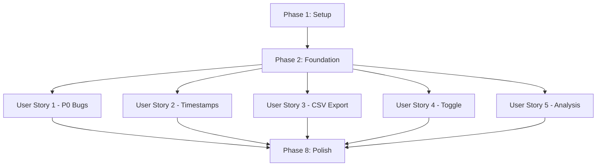

# Tasks: Instructor Mode Improvements

**Input**: Design documents from `/specs/003-instructor-mode-improvements/`
**Prerequisites**: plan.md, spec.md, research.md, data-model.md, contracts/, quickstart.md

**Tests**: TDD is MANDATORY per constitution. All test tasks must be completed FIRST with failing tests before implementation.

**Organization**: Tasks are grouped by user story to enable independent implementation and testing.

## Format: `[ID] [P?] [Story] Description`

- **[P]**: Can run in parallel (different files, no dependencies)
- **[Story]**: Which user story this task belongs to (US1, US2, US3, US4, US5)
- Include exact file paths in descriptions

## Path Conventions

Repository uses single project structure:
- `src/` - Source code (components, services, utilities)
- `tests/` - Test files (unit, integration, e2e)

---

## Phase 1: Setup (Shared Infrastructure)

**Purpose**: Minimal setup - no new infrastructure needed, all fixes use existing patterns

- [ ] T001 Create timestamp formatting utility in src/utils/date-helpers.ts
- [ ] T002 [P] Add virtual scrolling utility for performance in src/utils/virtual-list.ts
- [ ] T003 [P] Update CSS custom properties for modal z-index in src/styles/variables.css

---

## Phase 2: Foundational (Blocking Prerequisites)

**Purpose**: Core changes that multiple user stories depend on

**⚠️ CRITICAL**: No user story work can begin until this phase is complete

- [ ] T004 Update SessionService to clear instructor state on logout in src/services/session.js
- [ ] T005 Update StorageService to support answer overwriting for re-submissions in src/services/storage-service.js
- [ ] T006 Add event listener for logout in quiz table enhancer to clear UI state in src/enhancers/quiz-table.ts

**Checkpoint**: Foundation ready - user story implementation can now begin in parallel

---

## Phase 3: User Story 1 - Session Transition and UI Critical Fixes (Priority: P0) 🎯 MVP

**Goal**: Fix critical bugs blocking basic instructor functionality: clear student UI state on logout, fix modal z-index, fix fresh session toggle, fix button states, fix text contrast

**Independent Test**: Login as student, answer questions, logout, login as instructor - all instructor UI works correctly with no student state leakage

### Tests for User Story 1 (TDD - Write First)

> **NOTE: Write these tests FIRST, ensure they FAIL before implementation**

- [ ] T007 [P] [US1] Unit test for logout state clearing in tests/unit/services/session.test.js
- [ ] T008 [P] [US1] Unit test for quiz table state reset in tests/unit/enhancers/quiz-table.test.ts
- [ ] T009 [P] [US1] Integration test for student-to-instructor transition in tests/integration/instructor-mode.test.ts
- [ ] T010 [P] [US1] Unit test for modal z-index rendering in tests/unit/components/qd-instructor-scores.test.ts
- [ ] T011 [P] [US1] Unit test for fresh session data loading in tests/unit/components/qd-instructor.test.ts
- [ ] T012 [P] [US1] Unit test for export button state logic in tests/unit/components/qd-instructor-export.test.ts
- [ ] T013 [P] [US1] E2E test for complete session transition workflow in tests/e2e/workflows/instructor-review.spec.ts

### Implementation for User Story 1

- [ ] T014 [US1] Implement logout cleanup in qd-login component in src/components/qd-login.ts (FR-001, FR-002)
- [ ] T015 [P] [US1] Update quiz table enhancer to clear color-coded feedback on logout in src/enhancers/quiz-table.ts (FR-001, FR-002)
- [ ] T016 [P] [US1] Fix modal z-index in scores modal component in src/components/qd-instructor/qd-instructor-scores.ts (FR-003)
- [ ] T017 [P] [US1] Implement fresh session data loading in instructor component in src/components/qd-instructor/qd-instructor.ts (FR-004)
- [ ] T018 [P] [US1] Fix text contrast for toggle label in instructor component styles in src/components/qd-instructor/qd-instructor.ts (FR-005)
- [ ] T019 [P] [US1] Fix export button state check in export component in src/components/qd-instructor/qd-instructor-export.ts (FR-006)
- [ ] T020 [US1] Verify all tests pass for User Story 1

**Checkpoint**: All P0 critical bugs fixed - instructor mode is now fully functional

---

## Phase 4: User Story 2 - Answer Timestamp Visibility (Priority: P2)

**Goal**: Display timestamps in month/date/time format with 24-hour time throughout the application

**Independent Test**: Submit answers at known times, verify instructor view shows timestamps in "Nov 19 14:23" format consistently

### Tests for User Story 2 (TDD - Write First)

- [ ] T021 [P] [US2] Unit test for display timestamp formatting in tests/unit/utils/date-helpers.test.ts
- [ ] T022 [P] [US2] Unit test for CSV timestamp formatting (ISO 8601) in tests/unit/utils/date-helpers.test.ts
- [ ] T023 [P] [US2] Integration test for timestamp consistency across components in tests/integration/timestamp-display.test.ts

### Implementation for User Story 2

- [ ] T024 [P] [US2] Implement formatTimestamp utility functions in src/utils/date-helpers.ts (FR-007)
- [ ] T025 [P] [US2] Update instructor component to use formatTimestamp for display in src/components/qd-instructor/qd-instructor.ts
- [ ] T026 [P] [US2] Update scores modal to use formatTimestamp in src/components/qd-instructor/qd-instructor-scores.ts
- [ ] T027 [P] [US2] Update quiz table enhancer to show 24-hour timestamps in src/enhancers/quiz-table.ts
- [ ] T028 [US2] Verify all tests pass for User Story 2

**Checkpoint**: All timestamps now display consistently in 24-hour format

---

## Phase 5: User Story 3 - Export with Enhanced Metadata (Priority: P2)

**Goal**: Export CSV with all required columns including question text, timestamps (ISO 8601), and proper escaping

**Independent Test**: Click "Export to CSV", verify downloaded file has all required columns and handles special characters correctly

### Tests for User Story 3 (TDD - Write First)

- [ ] T029 [P] [US3] Unit test for CSV generation logic in tests/unit/components/qd-instructor-export.test.ts
- [ ] T030 [P] [US3] Unit test for CSV special character escaping in tests/unit/components/qd-instructor-export.test.ts
- [ ] T031 [P] [US3] Integration test for complete CSV export workflow in tests/integration/csv-export.test.ts

### Implementation for User Story 3

- [ ] T032 [US3] Implement enhanced CSV export logic in src/components/qd-instructor/qd-instructor-export.ts (FR-008, FR-009)
- [ ] T033 [US3] Add question text extraction for CSV in src/components/qd-instructor/qd-instructor-export.ts (FR-008)
- [ ] T034 [US3] Implement CSV special character escaping in src/components/qd-instructor/qd-instructor-export.ts (FR-009)
- [ ] T035 [US3] Optimize CSV generation for large datasets (100+ students) in src/components/qd-instructor/qd-instructor-export.ts (FR-010)
- [ ] T036 [US3] Verify all tests pass for User Story 3

**Checkpoint**: CSV export now includes full metadata and handles all edge cases

---

## Phase 6: User Story 4 - Bulk Answer Review Toggle (Priority: P3)

**Goal**: Persist "Show student answers" toggle state correctly across page navigation

**Independent Test**: Enable toggle on page 1, navigate to pages 2-5, verify toggle remains enabled without re-clicking

### Tests for User Story 4 (TDD - Write First)

- [ ] T037 [P] [US4] Unit test for toggle state persistence logic in tests/unit/components/qd-instructor.test.ts
- [ ] T038 [P] [US4] Integration test for toggle state across page navigation in tests/integration/toggle-persistence.test.ts
- [ ] T039 [P] [US4] E2E test for toggle state after browser close/reopen in tests/e2e/workflows/toggle-persistence.spec.ts

### Implementation for User Story 4

- [ ] T040 [US4] Implement robust toggle state persistence in src/components/qd-instructor/qd-instructor.ts (FR-011)
- [ ] T041 [US4] Add sessionStorage sync on toggle change in src/components/qd-instructor/qd-instructor.ts (FR-011)
- [ ] T042 [US4] Add state restoration on component mount in src/components/qd-instructor/qd-instructor.ts (FR-011)
- [ ] T043 [US4] Verify all tests pass for User Story 4

**Checkpoint**: Toggle state now persists correctly in all scenarios

---

## Phase 7: User Story 5 - Analysis Table Student Entries Display (Priority: P3)

**Goal**: Display analysis table student entries grouped by cell, sorted by timestamp (newest first), with placeholder for empty cells

**Independent Test**: Have 3+ students enter text in analysis tables, verify instructor view shows all entries organized clearly

### Tests for User Story 5 (TDD - Write First)

- [ ] T044 [P] [US5] Unit test for analysis entry grouping logic in tests/unit/enhancers/analysis-table.test.ts
- [ ] T045 [P] [US5] Unit test for timestamp sorting (newest first) in tests/unit/enhancers/analysis-table.test.ts
- [ ] T046 [P] [US5] Integration test for analysis table display in tests/integration/analysis-display.test.ts

### Implementation for User Story 5

- [ ] T047 [US5] Implement student entry grouping in analysis table enhancer in src/enhancers/analysis-table.ts (FR-012)
- [ ] T048 [US5] Implement timestamp sorting (newest first) in analysis table enhancer in src/enhancers/analysis-table.ts (FR-012)
- [ ] T049 [US5] Add "(No entries yet)" placeholder for empty cells in src/enhancers/analysis-table.ts (FR-013)
- [ ] T050 [US5] Apply 24-hour timestamp formatting to analysis entries in src/enhancers/analysis-table.ts
- [ ] T051 [US5] Verify all tests pass for User Story 5

**Checkpoint**: Analysis tables now show student work in organized, readable format

---

## Phase 8: Performance & Cross-Cutting Concerns

**Purpose**: Ensure system handles edge cases and large datasets

- [ ] T052 Implement virtual scrolling for 100+ student display in src/components/qd-instructor/qd-instructor.ts (FR-014)
- [ ] T053 Update storage service to handle answer re-submission (overwrite) in src/services/storage-service.js (FR-015)
- [ ] T054 Add performance tests for 100+ students in tests/integration/performance.test.ts
- [ ] T055 Run full test suite and verify all 15 requirements pass
- [ ] T056 Run bundle size check (ensure ≤35KB min+gzip)
- [ ] T057 Run accessibility audit (WCAG AA compliance)
- [ ] T058 Update documentation with new behaviors in demo/README.md

---

## Dependencies Between User Stories



**Key Dependencies**:
- All user stories depend on Phase 2 (Foundation)
- User stories 1-5 are otherwise independent (can be implemented in parallel)
- Phase 8 requires all user stories to be complete

---

## Parallel Execution Opportunities

### Within User Story 1 (P0)
```bash
# Tests can run in parallel
T007, T008, T009, T010, T011, T012 (all [P])

# Implementation tasks can run in parallel
T015, T016, T017, T018, T019 (all [P])
```

### Within User Story 2 (P2)
```bash
# All tests in parallel
T021, T022, T023 (all [P])

# All implementation in parallel
T024, T025, T026, T027 (all [P])
```

### Within User Story 3 (P2)
```bash
# All tests in parallel
T029, T030, T031 (all [P])
```

### Within User Story 4 (P3)
```bash
# All tests in parallel
T037, T038, T039 (all [P])
```

### Within User Story 5 (P3)
```bash
# All tests in parallel
T044, T045, T046 (all [P])
```

### Across User Stories
```bash
# After Foundation phase, these can ALL run in parallel:
User Story 1 (T007-T020)
User Story 2 (T021-T028)
User Story 3 (T029-T036)
User Story 4 (T037-T043)
User Story 5 (T044-T051)
```

---

## Implementation Strategy

### MVP Scope (User Story 1 Only)
The minimum viable product is User Story 1 (P0 bugs). This alone provides immediate value by fixing critical blocking issues.

**MVP Tasks**: T001-T020 (20 tasks)
**Estimated Effort**: 1-2 days with TDD
**Deliverable**: Fully functional instructor mode with no critical bugs

### Incremental Delivery
After MVP, deliver each user story as an independent increment:

1. **Sprint 1**: User Story 1 (P0) - Critical bug fixes
2. **Sprint 2**: User Story 2 (P2) - Timestamp improvements
3. **Sprint 3**: User Story 3 (P2) - Enhanced CSV export
4. **Sprint 4**: User Story 4 + 5 (P3) - Polish improvements
5. **Sprint 5**: Phase 8 - Performance & cross-cutting

Each sprint delivers testable, production-ready value.

---

## Task Summary

- **Total Tasks**: 58
- **Phase 1 (Setup)**: 3 tasks
- **Phase 2 (Foundation)**: 3 tasks
- **User Story 1 (P0)**: 14 tasks (7 tests + 7 implementation)
- **User Story 2 (P2)**: 8 tasks (3 tests + 5 implementation)
- **User Story 3 (P2)**: 8 tasks (3 tests + 5 implementation)
- **User Story 4 (P3)**: 7 tasks (3 tests + 4 implementation)
- **User Story 5 (P3)**: 8 tasks (3 tests + 5 implementation)
- **Phase 8 (Polish)**: 7 tasks
- **Parallelizable Tasks**: 35 (60% of total)

## Format Validation ✅

All tasks follow required format:
- ✅ Checkbox prefix `- [ ]`
- ✅ Task ID (T001-T058)
- ✅ [P] marker on parallelizable tasks
- ✅ [Story] label on user story tasks
- ✅ Clear descriptions with file paths
- ✅ Organized by user story for independent implementation