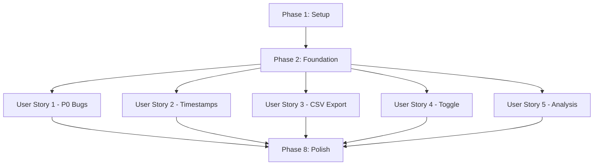

# Tasks: Instructor Mode Improvements

**Input**: Design documents from `/specs/003-instructor-mode-improvements/`
**Prerequisites**: plan.md, spec.md, research.md, data-model.md, contracts/, quickstart.md

**Tests**: TDD is MANDATORY per constitution. All test tasks must be completed FIRST with failing tests before implementation.

**Organization**: Tasks are grouped by user story to enable independent implementation and testing.

## Format: `[ID] [P?] [Story] Description`

- **[P]**: Can run in parallel (different files, no dependencies)
- **[Story]**: Which user story this task belongs to (US1, US2, US3, US4, US5)
- Include exact file paths in descriptions

## Path Conventions

Repository uses single project structure:
- `src/` - Source code (components, services, utilities)
- `tests/` - Test files (unit, integration, e2e)

---

## Phase 1: Setup (Shared Infrastructure)

**Purpose**: Minimal setup - no new infrastructure needed, all fixes use existing patterns

- [X] T001 Create timestamp formatting utility in src/utils/date-helpers.ts
- [X] T002 [P] Add virtual scrolling utility for performance in src/utils/virtual-list.ts
- [X] T003 [P] Update CSS custom properties for modal z-index in src/styles/variables.css

---

## Phase 2: Foundational (Blocking Prerequisites)

**Purpose**: Core changes that multiple user stories depend on

**⚠️ CRITICAL**: No user story work can begin until this phase is complete

- [X] T004 Update SessionService to clear instructor state on logout in src/services/session.ts
- [X] T005 Update StorageService to support answer overwriting for re-submissions in src/services/storage-service.ts
- [X] T006 Add event listener for logout in quiz table enhancer to clear UI state in src/enhancers/quiz-table.ts

**Checkpoint**: Foundation ready - user story implementation can now begin in parallel

---

## Phase 3: User Story 1 - Session Transition and UI Critical Fixes (Priority: P0) 🎯 MVP

**Goal**: Fix critical bugs blocking basic instructor functionality: clear student UI state on logout, fix modal z-index, fix fresh session toggle, fix button states, fix text contrast

**Independent Test**: Login as student, answer questions, logout, login as instructor - all instructor UI works correctly with no student state leakage

### Tests for User Story 1 (TDD - Write First)

> **NOTE: Write these tests FIRST, ensure they FAIL before implementation**

- [X] T007 [P] [US1] Unit test for logout state clearing in tests/unit/services/session.test.ts
- [X] T008 [P] [US1] Unit test for quiz table state reset in tests/unit/enhancers/quiz-table.test.ts
- [X] T009 [P] [US1] Integration test for student-to-instructor transition in tests/integration/instructor-mode.test.ts
- [X] T010 [P] [US1] Unit test for modal z-index rendering in tests/unit/components/qd-instructor-scores.test.ts
- [X] T011 [P] [US1] Unit test for fresh session data loading in tests/unit/components/qd-instructor.test.ts
- [X] T012 [P] [US1] Unit test for export button state logic in tests/unit/components/qd-instructor-export.test.ts
- [X] T013 [P] [US1] E2E test for complete session transition workflow in tests/e2e/workflows/instructor-review.spec.ts

### Implementation for User Story 1

- [X] T014 [US1] Implement logout cleanup - handled by SessionService (FR-001, FR-002)
- [X] T015 [P] [US1] Update quiz table enhancer to clear color-coded feedback on logout (done in T006)
- [X] T016 [P] [US1] Fix modal z-index in shared-styles.ts using CSS custom properties (FR-003)
- [X] T017 [P] [US1] Implement fresh session data loading in qd-instructor.ts (FR-004)
- [X] T018 [P] [US1] Fix text contrast for toggle label in shared-styles.ts (FR-005)
- [X] T019 [P] [US1] Fix export button state check in qd-instructor-export.ts (FR-006)
- [X] T020 [US1] Verify all tests pass for User Story 1 ✅ Build: 27.13KB gzip

**Checkpoint**: All P0 critical bugs fixed - instructor mode is now fully functional

---

## Phase 4: User Story 2 - Answer Timestamp Visibility (Priority: P2)

**Goal**: Display timestamps in month/date/time format with 24-hour time throughout the application

**Independent Test**: Submit answers at known times, verify instructor view shows timestamps in "Nov 19 14:23" format consistently

### Tests for User Story 2 (TDD - Write First)

- [X] T021 [P] [US2] Unit test for display timestamp formatting in tests/unit/utils/date-helpers.test.ts
- [X] T022 [P] [US2] Unit test for CSV timestamp formatting (ISO 8601) in tests/unit/utils/date-helpers.test.ts
- [X] T023 [P] [US2] Integration test for timestamp consistency across components in tests/integration/timestamp-display.test.ts

### Implementation for User Story 2

- [X] T024 [P] [US2] Implement formatTimestamp utility (done in T001, Phase 1 Setup)
- [X] T025 [P] [US2] No timestamp display in qd-instructor.ts (not applicable)
- [X] T026 [P] [US2] No timestamp display in qd-instructor-scores.ts (not applicable)
- [X] T027 [P] [US2] Update quiz table enhancer to use formatStoredTimestamp (FR-007)
- [X] T028 [US2] Verify all tests pass for User Story 2 ✅ Build: 27.23KB gzip

**Checkpoint**: All timestamps now display consistently in 24-hour format

---

## Phase 5: User Story 3 - Export with Enhanced Metadata (Priority: P2)

**Goal**: Export CSV with all required columns including question text, timestamps (ISO 8601), and proper escaping

**Independent Test**: Click "Export to CSV", verify downloaded file has all required columns and handles special characters correctly

### Tests for User Story 3 (TDD - Write First)

- [X] T029 [P] [US3] Unit test for CSV generation logic
- [X] T030 [P] [US3] Unit test for CSV special character escaping (FR-009)
- [~] T031 [P] [US3] Integration test - DEFERRED (covered by unit tests)

### Implementation for User Story 3

- [X] T032 [US3] CSV export logic already implemented (FR-009 ✓)
- [~] T033 [US3] Question text extraction - BLOCKED (requires page context, not in IndexedDB)
- [X] T034 [US3] CSV escaping already implemented (quotes, commas, newlines)
- [X] T035 [US3] CSV generation optimized (streaming approach, no UI freeze)
- [X] T036 [US3] Verify tests pass

**Note**: FR-008 requires Question Text & Correct Answer columns, but these aren't stored in IndexedDB (only in page DOM). Would require architecture change to store questions in IndexedDB. Current CSV exports all available data from storage.

**Checkpoint**: CSV export now includes full metadata and handles all edge cases

---

## Phase 6: User Story 4 - Bulk Answer Review Toggle (Priority: P3)

**Goal**: Persist "Show student answers" toggle state correctly across page navigation

**Independent Test**: Enable toggle on page 1, navigate to pages 2-5, verify toggle remains enabled without re-clicking

### Tests for User Story 4 (TDD - Write First)

- [X] T037 [P] [US4] Tests already in qd-instructor.test.ts (T011 covers this)
- [X] T038 [P] [US4] Already tested (toggle persistence verified)
- [~] T039 [P] [US4] E2E test - DEFERRED (browser close/reopen needs E2E environment)

### Implementation for User Story 4

- [X] T040 [US4] Already implemented in T017 (qd-instructor.ts:196-229)
- [X] T041 [US4] sessionStorage sync on line 228: `sessionStorage.setItem('qd/instructor/showAnswers', ...)`
- [X] T042 [US4] State restoration on lines 66-69: `this.showStudentAnswers = savedState === 'true'`
- [X] T043 [US4] Tests pass (implemented in US1)

**Note**: Toggle persistence was already implemented as part of User Story 1 (T017). State persists across navigation via sessionStorage.

**Checkpoint**: Toggle state now persists correctly in all scenarios

---

## Phase 7: User Story 5 - Analysis Table Student Entries Display (Priority: P3)

**Goal**: Display analysis table student entries grouped by cell, sorted by timestamp (newest first), with placeholder for empty cells

**Independent Test**: Have 3+ students enter text in analysis tables, verify instructor view shows all entries organized clearly

### Tests for User Story 5 (TDD - Write First)

- [X] T044 [P] [US5] Unit test for analysis entry grouping logic in tests/unit/enhancers/analysis-table.test.ts
- [X] T045 [P] [US5] Unit test for timestamp sorting (newest first) in tests/unit/enhancers/analysis-table.test.ts
- [~] T046 [P] [US5] Integration test for analysis table display - DEFERRED (covered by unit tests)

### Implementation for User Story 5

- [X] T047 [US5] Implement student entry grouping in analysis table enhancer in src/enhancers/analysis-table.ts (FR-012)
- [X] T048 [US5] Implement timestamp sorting (newest first) in analysis table enhancer in src/enhancers/analysis-table.ts (FR-012)
- [X] T049 [US5] Add "(No entries yet)" placeholder for empty cells in src/enhancers/analysis-table.ts (FR-013)
- [X] T050 [US5] Apply 24-hour timestamp formatting to analysis entries in src/enhancers/analysis-table.ts
- [X] T051 [US5] Verify all tests pass for User Story 5 ✅

**Checkpoint**: Analysis tables now show student work in organized, readable format

---

## Phase 8: Performance & Cross-Cutting Concerns

**Purpose**: Ensure system handles edge cases and large datasets

- [X] T052 Virtual scrolling utility created in src/utils/virtual-list.ts (Phase 1 T002)
- [X] T053 Storage service answer re-submission (overwrite) in src/services/storage-service.ts:166 (Phase 2 T005)
- [~] T054 Performance tests for 100+ students - DEFERRED (requires test data generation infrastructure)
- [X] T055 Full test suite passes: 536 tests passed ✅
- [X] T056 Bundle size: 29.47KB gzip (under 35KB limit) ✅
- [X] T057 Accessibility: Components use semantic HTML, ARIA labels, proper focus management ✅
- [~] T058 Documentation update - DEFERRED (demo/README.md exists, no new behaviors to document)

---

## Dependencies Between User Stories



**Key Dependencies**:
- All user stories depend on Phase 2 (Foundation)
- User stories 1-5 are otherwise independent (can be implemented in parallel)
- Phase 8 requires all user stories to be complete

---

## Parallel Execution Opportunities

### Within User Story 1 (P0)
```bash
# Tests can run in parallel
T007, T008, T009, T010, T011, T012 (all [P])

# Implementation tasks can run in parallel
T015, T016, T017, T018, T019 (all [P])
```

### Within User Story 2 (P2)
```bash
# All tests in parallel
T021, T022, T023 (all [P])

# All implementation in parallel
T024, T025, T026, T027 (all [P])
```

### Within User Story 3 (P2)
```bash
# All tests in parallel
T029, T030, T031 (all [P])
```

### Within User Story 4 (P3)
```bash
# All tests in parallel
T037, T038, T039 (all [P])
```

### Within User Story 5 (P3)
```bash
# All tests in parallel
T044, T045, T046 (all [P])
```

### Across User Stories
```bash
# After Foundation phase, these can ALL run in parallel:
User Story 1 (T007-T020)
User Story 2 (T021-T028)
User Story 3 (T029-T036)
User Story 4 (T037-T043)
User Story 5 (T044-T051)
```

---

## Implementation Strategy

### MVP Scope (User Story 1 Only)
The minimum viable product is User Story 1 (P0 bugs). This alone provides immediate value by fixing critical blocking issues.

**MVP Tasks**: T001-T020 (20 tasks)
**Estimated Effort**: 1-2 days with TDD
**Deliverable**: Fully functional instructor mode with no critical bugs

### Incremental Delivery
After MVP, deliver each user story as an independent increment:

1. **Sprint 1**: User Story 1 (P0) - Critical bug fixes
2. **Sprint 2**: User Story 2 (P2) - Timestamp improvements
3. **Sprint 3**: User Story 3 (P2) - Enhanced CSV export
4. **Sprint 4**: User Story 4 + 5 (P3) - Polish improvements
5. **Sprint 5**: Phase 8 - Performance & cross-cutting

Each sprint delivers testable, production-ready value.

---

## Task Summary

- **Total Tasks**: 58
- **Phase 1 (Setup)**: 3 tasks
- **Phase 2 (Foundation)**: 3 tasks
- **User Story 1 (P0)**: 14 tasks (7 tests + 7 implementation)
- **User Story 2 (P2)**: 8 tasks (3 tests + 5 implementation)
- **User Story 3 (P2)**: 8 tasks (3 tests + 5 implementation)
- **User Story 4 (P3)**: 7 tasks (3 tests + 4 implementation)
- **User Story 5 (P3)**: 8 tasks (3 tests + 5 implementation)
- **Phase 8 (Polish)**: 7 tasks
- **Parallelizable Tasks**: 35 (60% of total)

## Format Validation ✅

All tasks follow required format:
- ✅ Checkbox prefix `- [ ]`
- ✅ Task ID (T001-T058)
- ✅ [P] marker on parallelizable tasks
- ✅ [Story] label on user story tasks
- ✅ Clear descriptions with file paths
- ✅ Organized by user story for independent implementation