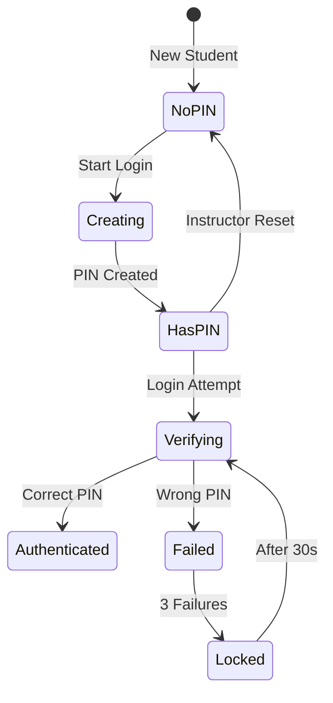
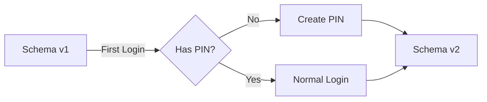

# Data Model: Student PIN Authentication

**Date**: 2025-11-21
**Schema Version**: 2 (upgrade from v1)

## Entity Definitions

### StudentRecord (v2)

Extended student record with PIN authentication support.

```typescript
interface StudentRecord {
  // Metadata
  schema: 2;                      // Upgraded from 1
  docId: string;                   // Document identifier

  // Identity
  release: ReleaseId;              // e.g., "Autumn 2025"
  serviceId: ServiceId;            // e.g., "RN2344"
  name: string;                    // Student display name

  // Authentication (NEW)
  pinHash: string;                 // SHA-256 hash of 4-digit PIN
  pinCreatedAt?: string;           // ISO 8601 timestamp
  pinResetAt?: string;             // ISO 8601 timestamp (if reset)

  // Progress (unchanged)
  attempted: number;               // Questions attempted
  correct: number;                 // Questions answered correctly
  updated: string;                 // Last activity ISO 8601
  pages: Record<PageId, PageData>; // Quiz responses by page
}
```

### PinAttemptState

Tracks failed PIN attempts for rate limiting (sessionStorage).

```typescript
interface PinAttemptState {
  serviceId: ServiceId;            // Student identifier
  attempts: number;                // Failed attempt count (0-3)
  lockoutUntil: string | null;     // ISO 8601 timestamp or null
  lastAttempt: string;             // ISO 8601 timestamp
}
```

### PinResetEvent

Audit trail for instructor PIN resets (stored in IndexedDB).

```typescript
interface PinResetEvent {
  eventId: string;                 // UUID v4
  serviceId: ServiceId;            // Student affected
  resetBy: 'instructor';           // Actor type
  resetAt: string;                 // ISO 8601 timestamp
  release: ReleaseId;              // Context
}
```

## State Transitions

### PIN Lifecycle



### Schema Migration



## Storage Locations

### IndexedDB (`BrowserTest` database)

**Object Store**: `students`
- **Key**: Composite `qd/{release}/u{serviceId}`
- **Value**: `StudentRecord` (v2)
- **Indexes**:
  - `serviceId` (for lookups)
  - `updated` (for sorting)

**Object Store**: `auditLog` (NEW)
- **Key**: Auto-increment
- **Value**: `PinResetEvent`
- **Indexes**:
  - `serviceId` (for history)
  - `resetAt` (for sorting)

### SessionStorage

**Key**: `qd:pin-attempts:{serviceId}`
- **Value**: `PinAttemptState` (JSON)
- **TTL**: Browser session
- **Cleanup**: On successful login or tab close

## Validation Rules

### PIN Format
- Exactly 4 characters
- Digits only (0-9)
- Leading zeros allowed ("0001" is valid)
- No whitespace

### PIN Creation
- Must confirm (enter twice)
- Both entries must match exactly
- Cannot be empty
- Stored as SHA-256 hash immediately

### PIN Verification
- Constant-time comparison against stored hash
- Max 3 attempts per session
- 30-second lockout after 3 failures
- Counter resets on success

### Migration Rules
- Students with `schema: 1` prompted for PIN on next login
- All existing data preserved
- `pinHash` starts empty, filled on first login
- No batch migration needed

## Relationships

### Student → PIN (1:1)
- Each student has exactly one PIN hash
- PIN required for authentication
- PIN can be reset but not removed

### Student → Attempts (1:0..1)
- Rate limiting state exists only during failed attempts
- Cleared on successful login
- Isolated per browser tab

### Student → Reset Events (1:0..n)
- Zero or more reset events per student
- Append-only audit log
- Never deleted

## Query Patterns

### Common Queries

1. **Get Student with PIN Check**
```typescript
const key = `qd/${release}/u${serviceId}`;
const student = await db.get('students', key);
if (student.schema === 1) {
  // Trigger migration flow
}
```

2. **Check Rate Limit**
```typescript
const attemptKey = `qd:pin-attempts:${serviceId}`;
const state = JSON.parse(
  sessionStorage.getItem(attemptKey) || '{}'
);
if (state.lockoutUntil && new Date(state.lockoutUntil) > new Date()) {
  // Still locked out
}
```

3. **Reset PIN**
```typescript
student.pinHash = '';
student.pinResetAt = new Date().toISOString();
await db.put('students', student, key);
// Also log audit event
```

## Performance Considerations

- PIN hashing: <10ms (SHA-256 is fast)
- Constant-time comparison: <1ms
- IndexedDB operations: <50ms
- SessionStorage: <5ms
- Total login flow: <200ms

## Security Considerations

- Never store plaintext PINs
- Hash immediately on input
- Clear memory after use
- No PIN values in logs
- Audit trail for resets
- Rate limiting prevents brute force